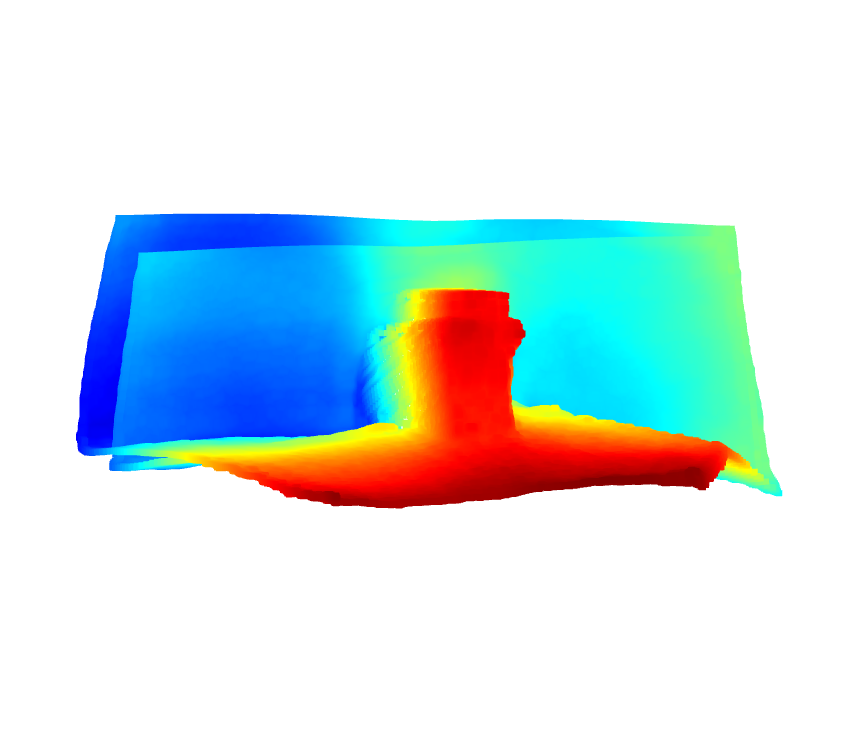
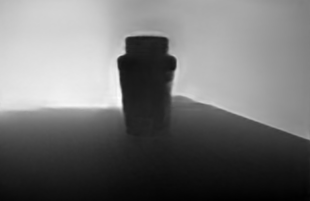

# a collection of some computer vis stuff

each file can be run on its own for examples or the functions can be imported

## images

 my water bottle, constructed with multiple images from the same angle
 my water bottle, constructed with multiple images from different angles
 depth map of my water bottle

## TODO

- [x] multiple images to pcd, maybe this will be feat extraction
- [x] bitwise or pcd merging
- [ ] opencv orb feature extraction
- [ ] add mesh, reconstruct from pcd

## notes

- you can add multiple pcds together, like o3d.visualization.draw_geometries([pcd1, pcd2]) but the camera view needs to be normalized or it won't work
- or maybe pcd = pcd1 + pcd2
